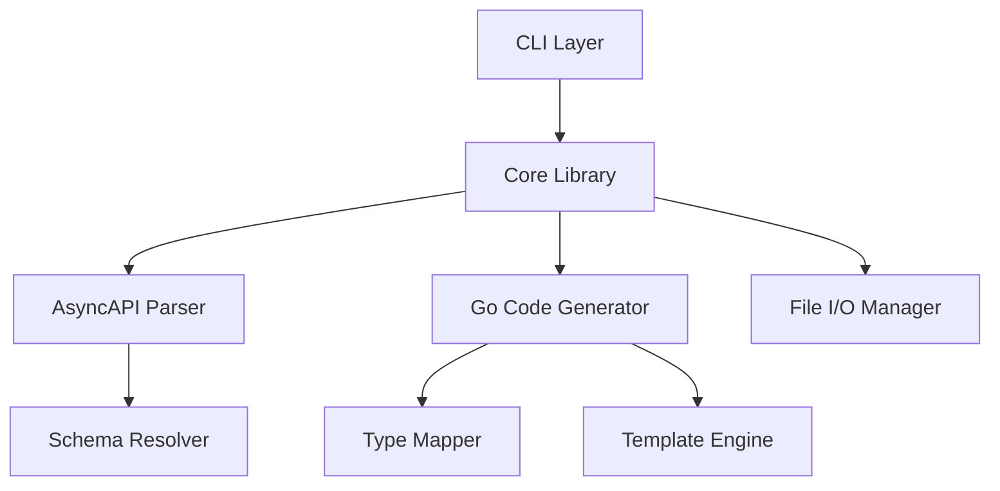

# Design Document

## Overview

The AsyncAPI Go Code Generator is a library and CLI tool that parses AsyncAPI specification files (JSON/YAML) and generates corresponding Go type definitions. The system follows a modular architecture with clear separation between parsing, code generation, and CLI concerns.

The tool supports AsyncAPI 2.x and 3.x specifications and generates idiomatic Go code with proper struct tags, comments, and naming conventions. It can be used both as a standalone CLI application and as a Go library for programmatic integration.

## Architecture

The system follows a layered architecture with the following main components:



### Component Responsibilities

- **CLI Layer**: Command-line interface handling, argument parsing, and user interaction
- **Core Library**: Public API for programmatic usage, orchestrates parsing and generation
- **AsyncAPI Parser**: Parses AsyncAPI specifications and validates structure
- **Schema Resolver**: Resolves external schema references and handles $ref pointers
- **Go Code Generator**: Transforms parsed schemas into Go type definitions
- **Type Mapper**: Maps AsyncAPI/JSON Schema types to Go types
- **Template Engine**: Generates formatted Go code using templates
- **File I/O Manager**: Handles file reading, writing, and directory management

## Components and Interfaces

### Core Library Interface

```go
// Generator provides the main API for AsyncAPI to Go code generation
type Generator struct {
    config *Config
}

// Config holds generation configuration options
type Config struct {
    PackageName    string
    OutputDir      string
    IncludeComments bool
    UsePointers    bool
}

// ParseResult contains the parsed AsyncAPI specification
type ParseResult struct {
    Spec     *AsyncAPISpec
    Messages map[string]*MessageSchema
    Errors   []error
}

// GenerateResult contains the generated Go code
type GenerateResult struct {
    Files   map[string]string // filename -> content
    Errors  []error
}
```

### AsyncAPI Parser Interface

```go
// Parser handles AsyncAPI specification parsing
type Parser interface {
    Parse(data []byte) (*ParseResult, error)
    ValidateVersion(version string) error
}

// AsyncAPISpec represents a parsed AsyncAPI specification
type AsyncAPISpec struct {
    Version  string
    Info     Info
    Channels map[string]*Channel
    Messages map[string]*MessageSchema
}
```

### Code Generator Interface

```go
// CodeGenerator transforms schemas into Go code
type CodeGenerator interface {
    GenerateTypes(messages map[string]*MessageSchema, config *Config) (*GenerateResult, error)
    GenerateStruct(schema *MessageSchema, name string) (string, error)
}

// TypeMapper maps AsyncAPI types to Go types
type TypeMapper interface {
    MapType(schemaType string, format string) string
    MapProperty(prop *Property) *GoField
}
```

### CLI Interface

```go
// CLIConfig holds command-line configuration
type CLIConfig struct {
    InputFile   string
    OutputDir   string
    PackageName string
    Verbose     bool
    Help        bool
}

// CLI handles command-line operations
type CLI struct {
    generator *Generator
}
```

## Data Models

### AsyncAPI Schema Models

```go
// MessageSchema represents an AsyncAPI message schema
type MessageSchema struct {
    Name        string
    Title       string
    Description string
    Type        string
    Properties  map[string]*Property
    Required    []string
}

// Property represents a schema property
type Property struct {
    Type        string
    Format      string
    Description string
    Items       *Property // for arrays
    Properties  map[string]*Property // for objects
    Required    bool
}
```

### Go Code Models

```go
// GoStruct represents a generated Go struct
type GoStruct struct {
    Name        string
    PackageName string
    Fields      []*GoField
    Comments    []string
}

// GoField represents a Go struct field
type GoField struct {
    Name     string
    Type     string
    JSONTag  string
    Comment  string
    Optional bool
}
```

## Error Handling

The system implements structured error handling with specific error types:

```go
// ParseError represents AsyncAPI parsing errors
type ParseError struct {
    Message string
    Line    int
    Column  int
}

// ValidationError represents schema validation errors
type ValidationError struct {
    Field   string
    Message string
}

// GenerationError represents code generation errors
type GenerationError struct {
    Schema  string
    Message string
}
```

Error handling strategy:
- Parse errors are collected and returned with context
- Validation errors include field-specific information
- Generation errors specify which schema caused the issue
- CLI errors include usage hints and exit codes

## Testing Strategy

### Unit Testing
- **Parser Tests**: Test AsyncAPI parsing with valid/invalid specifications
- **Type Mapper Tests**: Verify correct mapping of AsyncAPI types to Go types
- **Code Generator Tests**: Test Go code generation with various schema patterns
- **CLI Tests**: Test command-line argument parsing and error handling

### Integration Testing
- **End-to-End Tests**: Test complete workflow from AsyncAPI file to generated Go code
- **File I/O Tests**: Test file reading/writing operations
- **Template Tests**: Verify generated code compiles and follows Go conventions

### Test Data
- Sample AsyncAPI specifications covering various schema patterns
- Expected Go code outputs for comparison
- Invalid AsyncAPI files for error handling tests
- Edge cases: empty schemas, deeply nested objects, circular references

### Testing Tools
- Go's built-in testing framework
- Testify for assertions and mocking
- Golden file testing for code generation verification
- Coverage reporting to ensure comprehensive test coverage

## Implementation Notes

### AsyncAPI Version Support
- Primary support for AsyncAPI 2.6 and 3.0
- Version detection and validation during parsing
- Graceful handling of unsupported versions with clear error messages

### Go Code Generation Patterns
- PascalCase conversion for struct and field names
- JSON tags with original property names
- Pointer types for optional fields
- Slice types for arrays with proper element types
- Nested struct generation for object properties

### CLI Design
- Follows standard Unix CLI conventions
- Supports both short and long flag formats
- Provides helpful error messages and usage information
- Returns appropriate exit codes for scripting integration

### Performance Considerations
- Streaming parser for large AsyncAPI files
- Efficient memory usage during code generation
- Concurrent processing where applicable
- Caching of resolved schema references